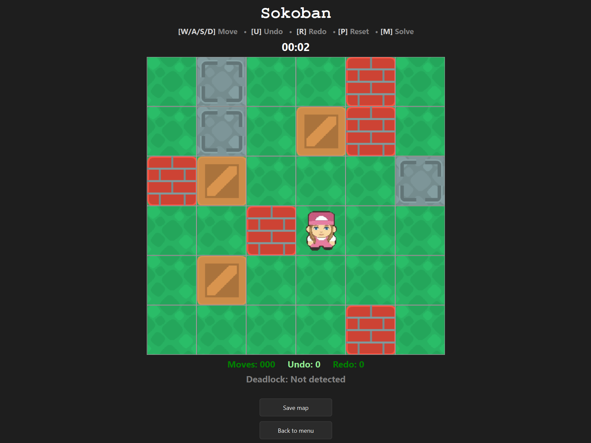

# Sokoban



## Overview

This is a Sokoban game written in **Python** with three core modes: **Singleplayer**, **Multiplayer** and **AI Co-op**.

## Game Modes

### Singleplayer

Singleplayer includes multiple gameplay variants selectable in settings and focuses on classic Sokoban puzzle solving.

Key features:

- Standard movement and box-pushing gameplay
- **Undo / Redo** support
- **Level reset**
- **Auto-solve** for the current level (triggered with `M`)
- **Save / Load** map state (map management)
- Persistent **statistics tracking**

In singleplayer, automated solving and AI movement behavior use the **A*** pathfinding algorithm (with JSON-configurable tuning such as movement timing and search depth).

### Multiplayer

Multiplayer lets you play with another player over the network.

- Join or host online sessions
- Configure networking in `config.py`
- When hosting, run `server.py` in parallel with the game client

### AI Co-op

AI Co-op is a collaborative mode where you play together with a bot.

- Player and AI work together to move boxes
- AI decision logic relies on the **A*** pathfinding algorithm


## Installation

1. Ensure you have [`uv`](https://docs.astral.sh/uv/) installed.
2. Synchronize dependencies:

```bash
uv sync
```

## Running the Game

Start the main game client with:

```bash
uv run main.py
```

If you are hosting a multiplayer session, run the server in parallel:

```bash
uv run server.py
```

## Configuration

### `config.py` (Multiplayer)

For online multiplayer, adjust `config.py` depending on your role:

- **Host:** configure host/server settings, then run `server.py`
- **Client/Joiner:** configure connection target to join the host

### Playing Online via ngrok (TCP)

If you want to play online with someone outside your local network, you can tunnel your server using **ngrok**.

1. Host starts the server locally on port `9999`.
2. Host runs:

```bash
ngrok tcp 9999
```

3. Host keeps local server config as:

```python
host = "localhost"
port = 9999
```

4. ngrok displays a public TCP endpoint (example):
   - Host: `6.tcp.eu.ngrok.io`
   - Port: `16350`

5. The joining player edits `config.py` to match the ngrok endpoint shown to the host:

```python
host = "6.tcp.eu.ngrok.io"
port = 16350
```

Use exactly the host and port currently shown in the host's ngrok session.

### A* Tuning Parameters (Map JSON)

A* behavior can be configured inside the saved map JSON file:

- `a_star_move_time`  
  Defines how quickly AI performs movement steps.
- `max_a_star_moves`  
  Defines the maximum depth/number of A* moves to explore before stopping.

These parameters help prevent excessively long searches and allow balancing responsiveness vs. solution depth.

## Controls

- **`W / A / S / D`** — Move
- **`U`** — Undo
- **`R`** — Redo
- **`P`** — Reset level
- **`M`** — Solve level automatically

## Project Structure

```text
sokoban/
├─ .gitignore
├─ .python-version
├─ README.md
├─ main.py                      # Main game entry point
├─ pyproject.toml               # Project metadata and dependencies
├─ uv.lock                      # Locked dependency versions for uv
├─ engine/                      # Core game logic
├─ ui/                          # User interface layer
├─ TCP/                         # Networking / multiplayer TCP logic
└─ sokoban-assets/              # Game assets (graphics/audio/resources)
```

## Assets and Audio

- **Player skins** and **sound effects** were generated with **Google Gemini AI**.
- Assets for **grass**, **boxes**, **goals** and **obstacles** are from **Kenney – Sokoban pack**:  
  https://kenney.nl/assets/sokoban

## Notes

- Singleplayer mode allows selecting different gameplay variants from settings.
- Multiplayer requires correct network configuration before starting.
- For internet play, ngrok TCP can be used to expose the host server.
- AI/pathfinding parameters can be tuned in saved map JSON files.